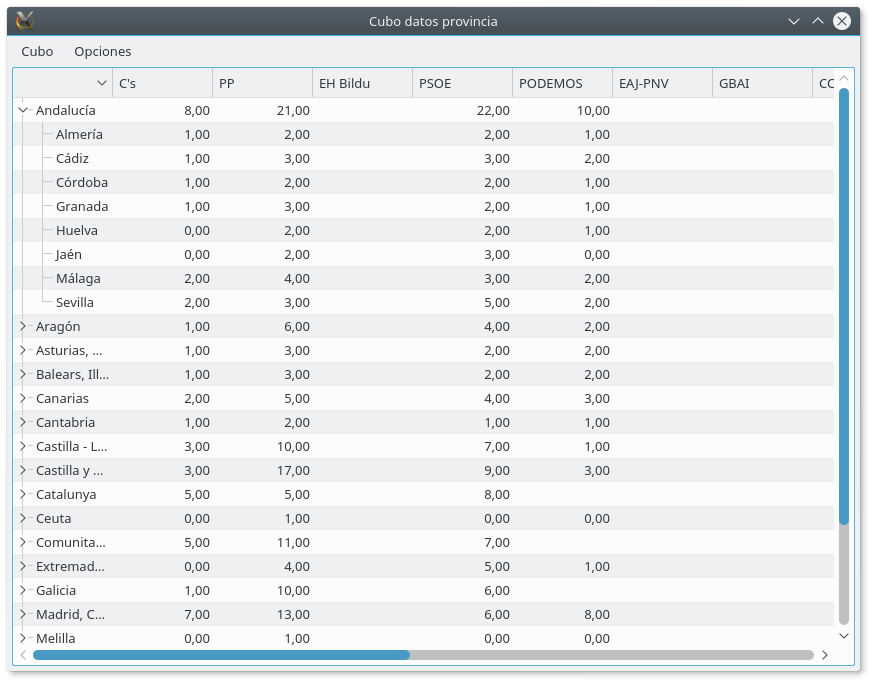

# dana-cube

Dana-cube is a tool to automate the design, execution and visualization of cross reference queries, aka pivot tables aka multidimensional aggregate queries.

## What's the problem:

A common problem an SQL database users is to solve the need to resolve an aggregate (sum, aver,...) by two or more parameters, f.i. Give me the sum of sales per country and per line of product The, very simple, SQL query gives a tabular result (country,line,sum(sales)) but the normal way we want to is as a spreadsheet (countries as rows, lines as columns) but this is NOT usually available in most data query programs.
Resourceful users can use MS Access cross reference queries to get this or use Pivot Tables available in several spreadsheet programs, but the cost -and most ofter the unwieldness- of linking REAL databases to this products do not make them really sustainable options in the long run.

At the other end of the spectrum, very expensive (in more senses than cost) OLAP products tend to serve the same end, but are usually an overkill; and for various reasons distribution in an organization is restricted, lowering its impact

## What we provide

We provide a database, OS agnostic environment for runing and managing those kind of queries and show them in tabular fashion.

We have created an environment where you can run an arbitrary aggregate query and show it in tabular fashion.



This is __not an end user tool__ , rather it is designed to be used for knowledgable users (DBAs, developers, data owners) or as a ready made __API__ cum sample tool to ne integrated in other's people work (as it still is in heavy development, _Caveat emptor_ ).

Each instance of the application runs against what we call a Cube. This is the view of a data table (or table-like DB object -a view, a select statement, ...) and the definition of the potential indexes over which to search. This indexes can be scalar fields or hierarchical structures. If the index is a date field; we automatically provide (for SQLITE, MySQL, PostGreSQL and Oracle, atm) for several subindexes (years, years-month, ...) The definition of the Cube is a simple text (Json) file like this

```
    "datos light": {
        "base filter": "", 
        "table": "votos_locales", 
        "guides": [
            {
                "prod": [
                    {
                        "source": {
                            "filter": "", 
                            "table": "partidos", 
                            "code": "code", 
                            "desc": "acronym"
                        }, 
                        "fmt": "txt", 
                        "elem": "partido"
                    }
                ], 
                "name": "partido", 
                "class": "o"
            }, 
            ...
        ], 
        "connect": {
            "dbuser": null, 
            "dbhost": null, 
            "driver": "QSQLITE", 
            "dbname": "/home/werner/projects/dana-cube.git/ejemplo_dana.db", 
            "dbpass": null
        }, 
        "fields": [
            "votes_presential", 
            "votes_percent", 
            "ord"
        ]
    }, 
 ```

Why a text file for definition? Getting the table definitions from the DB Catalog is one of the areas not standarized in SQL, nor the underlying tool i'm using (QtSQL) abstract them. Although we have plans to overcome it, it is no trivial task and we decided to postpone its implementation to a point when the tool is more mature. Second, text files are easy to distribute and for "emergency' changes. 

The tool is programmed in python2 + PyQt5?, but we test it also under python3.


## License

For my part, while I (Werner Llácer Viciano) retain all ownership of the code, you can use it as you see fit.

Good policy would be to, at least, acknowledge my autorship of this piece of code and, even better, to send upstream all corrections and enhancements to the original functionality.

PyQt licensing might impose other restrictions, please keep an eye on it (AFAIK it is __GPL__ licensed)


## Actual Status

__MASTER works__ but some pieces are lacking (Above all documentation). You can download the latest release to test it


_Update Saturday of the BVM_: New GUI based on the Model View elements of Qt. Still some parts missing

_Update Feria after Feast of St. Vincent Ferrer 2016_: __MASTER WORKS__. Only functionality missing is a statistical test (fivepoints) i've disabled pending
further revisions. Outside of this, it's functionally identical to the '12 version

_Update Feast of St. Vincent Ferrer 2016_: Work has progressed steadily. Upgrade to new versions seems to work, and i'm 
in a process of heavy refactoring of the core functionality. Sadly that implies that _MASTER_ is broken, and might be for some time.
I made a release from the old codebase which does work. Still have to master Github to know how to mantain them in parallel, so pls. be patient with bugs in there

_Update Easter Monday 2016_: work has resumed. At first we'll center only in Python 3 -and Qt 5- compatibility). 

I hope to make some inroads into new functionality.


Active tasks can be read [here](../docs/todo.md)


## Historical info

### History:
As of June,12 2012 HEAD is loaded with functional code (it just lacks some UI functions we want in 0.1). The user interface is rather primitive and has been "lifted" from the "numbers" example of Mark Summerfield's book "Rapid GUI Programming with Python and Qt. Definitive Guide to PyQt?"

### Current Plans (Just for historical value. Nothing came out of it)
Updated at the Feast of St. Agnes, 2014 In case you haven't noticed it, development has stalled, but i'm still out there. I hope to resume work in the short term. Probably i'll drop QtSql? as DB backend ... 

Updated at the Feast of the Sacred Hearth of Jesus, 2012. Due to some rather unexpected events -not all negative-, release schedule is in a bit of flux. But let's see how things develop Version 0.1 Due July, 1. Although HEAD should be usable by now. We plan to have all the core functionality implemented by then, with only minor functional aspects wanting. UI, error handling and doc will still be primitive we could introduce several intermediate releases and

By September, 15 release Version 0.2 Our milestone for this version is to introduce an n-dimensional interface (several queries shown at once -or at least in tabs), and to close other known deficiences (and as much of the unknown posible ;-)

We have still no plans to introduce an UI to generate the YAML (text) definition file at the core of the product. We try to be DB agnostic and the retrieval of the catalog is not an standard area, nor QtSQl abstract this. We are researching into this ...

## Help Needed

We could profit from someone knowledgable in UI development. I'm a DBA type and, well, it's kind of difficult for me

Testers are welcome.

## Out there ...

If you feel my package isn't cooked enough for you (nor for me either :-( ) have a look at the [Cubes project](https://github.com/DataBrewery/cubes) It might be of interest for you

A.M.D.G. & B.V.M.
