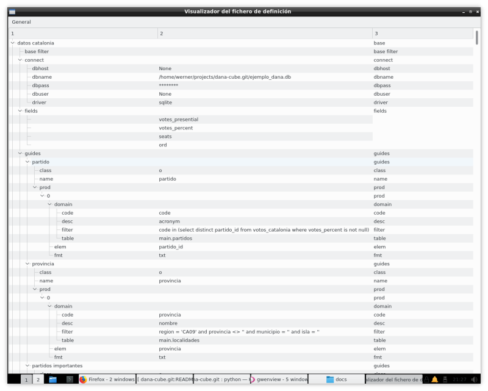

# dana-cube

Dana-cube is a tool to automate the design, execution and visualization of __cross reference queries__, aka __pivot tables__ aka __multidimensional aggregate queries__.

*[Go to the english version of the rationale](#rationale-in-english)

Dana-cube es una herramienta para automatizar el diseño, ejecución y visualización de __consultas de referencias cruzadas__ aka __tablas pivote__ aka __consultas agregadas multidimensionales__

*[Ir a la descripción de objetivos en Español](#objetivos-en-español)

# Tabla de contenidos / Table of contents

* [dana-cube](#dana-cube)
* [Objetivos en Español](#objetivos-en-español)
    * [Cual es el problema:](#cual-es-el-problema)
    * [Que ofrecemos](#que-ofrecemos)
    * [Donde funciona](#donde-funciona)
* [Rationale in English](#rationale-in-english)
    * [What's the problem:](#whats-the-problem)
    * [What we provide](#what-we-provide)
    * [Where to run the tool](#where-to-run-the-tool)
* [Documentation](#documentation)
* [Sample Data](#sample-data)
* [Dependencies](#dependencies)
* [License](#license)
* [DANACUBE enters <strong>ALPHA</strong>](#danacube-enters-alpha)
* [Help Needed](#help-needed)
* [Out there ...](#out-there-)
* [Contact](#contact)


# Objetivos en Español

## Cual es el problema:


Una herramienta que me permita resolver, quizas el más común de los problemas con bases de datos SQL: __resolver una agregación  (suma, promedio, ...) por dos o mas parámetros y presentarlos en formato matricial (hoja de calculo)__ Y de forma dinámica, es decir que no necesite estar programada previamente.

Un ejemplo canónico sería de consulta de este tipo sería _dame la suma total de ventas de un periodo desglosada por linea de producto y ámbito territorial_ y lo de __dinámica__ que ahora pueda cambiar el cruce a _vendedor_ y _rating financiero del cliente_ sin necesidad de que este cruce este previamente creado.

Primero querría explicar el por qué es útil una herramienta especifica para ello. Veamoslo con un ejemplo. Imaginen una base de datos de resultados electorales y lo que queremos es una consulta del tipo 

_Dame la suma de votos cruzados por partido y distrito electoral_. 

En teoría esto es una consulta muy sencilla en _SQL_

```
    select partido_id,provincia,sum(votes_presential)
    from votos_locales
    group by partido_id,provincia
```
Que devuelve los resultados de esta forma

```
"993"	"12"	"2134"
"993"	"46"	"7101"
"993"	"47"	"1570"
"1033"	"23"	"1188"
"1070"	"24"	"1027"
"1079"	"01"	"10468"
"1079"	"02"	"33676"
"1079"	"03"	"154037"
"1079"	"04"	"44320"
"1079"	"05"	"15892"
"1079"	"06"	"45252"
"1079"	"07"	"71446"
....
```
Toda la información está aquí, pero un analista resulta mejor servido si los datos pudieran ser presentados de format matricial (partidos como columnas, distritos como filas) y, si es posible, con información mas legible, por ejemplo como

```

                               C's       EH Bildu        EAJ-PNV             PP           PSOE        PODEMOS           GBAI        CCa-PNC        IU-UPeC   ...
Grand Total               3,500,541        218,467        301,585      7,215,752      5,530,779      3,182,082         30,554         81,750        923,133  
Araba/Álava                  10,468         21,179         28,297         33,609         25,293         48,265                                        6,794                                                                                                         
Albacete                     33,676                                       85,152         65,074         32,155                                        9,277                                                                                                         
Alicante/Alacant            154,037                                      296,709        188,367                                                      33,293
Almería                      44,320                                      117,407         89,022         39,482                                       10,776                                                                                                         
Ávila                        15,892                                       46,963         20,129         11,863                                        3,878                                                                                                         
Badajoz                      45,252                                      137,501        148,347         47,203                                       12,281                                                                                                         
Balears, Illes               71,446                                      140,542         88,542        111,416                                       11,434
Barcelona                   386,143                                      321,268        463,612                                                            
Burgos                       33,373                                       81,780         44,488         36,612                                       10,099                                                                                                         
Cáceres                      28,293                                       87,729         84,532         34,552                                        7,216                                                                                                         
Cádiz                        94,707                                      179,054        180,667        130,215                                       38,798                                                                                                         
Castellón/Castelló           48,220                                       98,341         66,450                                                       9,565
...
```

## Qué alternativas hay 

Desgraciadamente este tipo de presentación __NO esta disponible directamente__ en la mayoría de programas de consulta. Algunos productos (como Oracle y MSSQL) ofrecen soluciones privadas para generar este tipo de consultas, pero casi nunca están disponibles en las herramientas generales. 

En la mayoría de las aplicaciones existen _programas de informes_ que realizan algun tipo de operación de este tipo, pero __carecen de flexibilidad__ lo que se puede consultar y cruzar esta predefindo por la aplicación original y no puede crearse un nuevo cruce sobre la marcha.

Existen una serie de productos en el mercado (conocidos como __data warehouse__, __business inteligence__, ...) que permiten estas consultas dinámicas, y muchas mas cosas sobre ello. Normalmente estan vinculados a una base de datos o un tipo de problema concreto, y tienden a ser muy __complejas y costosas en recursos__ (técnicos y de personal, al menos). Lo que nosotros queremos es una herramienta simple, y limitada al problema de las referencias cruzadas

Las _consultas de referencias cruzadas_ de MS Access y las _tablas Pivot_ en muchas hojas de cálculo ofrecen la funcionalidad. Y he visto algunas soluciones extremadamente interesantes con ellas. Pero el mecanismo exige que el usuario __trabaje sobre  la estructura interna__ de la base de datos, que puede ser muy compleja.

Además, la estabilidad, mantenibilidad, seguridad y las posibilidades de distribuir estas soluciones sobre Access y/o Excel  son muy problemáticas. Mi experiencia con el rendimiento de los enlaces via ODBC es menor que buena. Y como antiguo administrador, "enganchar" a una base de datos corporativa "real", una herramienta tan incontrolable como es la interfaz ODBC, es una pesadilla desde el punto de vista de la seguridad y, probablemente también, del rendimiento.

## Que ofrecemos

ofrecemos un programa __danacube.py__ para que los usuarios puedan ejectuar y visualizar interactivamente las distintas consultas cruzadas sobre una base de datos. 


Como se puede ver en el ejemplo, __no referenciamos directamente a la base de datos subyacente, sino a una abstracción__
Cada instancia se ejecuta contra lo que denominamos un __Cubo__ esto es la visión de una tabla de datos (o estructura equivalente), los campos (__fields__) sobre los que queremos hacer las agregaciones y los criterios de agrupación (que denominamos __guias__). Estos criterios pueden ser campos escalares o agrupaciones jerarquizadas. Si las guias son fechas, automaticamente ofrecemos la posibilidad de jeraquizarlos (por años, años-mes, ...). Cada __consulta cruzada__ entre dos guias lo que denominamos __Vista__. 

Las definiciones de estos _Cubos_ se hacen a través de ficheros de texto (_json__), con lo que los posibles accesos a la base de datos están controlados externamente.

Y el acceso se realiza internamente a través de una _API_   con la intención de simplificar la generación de estas matrices / referencias cruzadas; permitiendo, además integrarlas en otras aplicaciones . A traves de esta interfaz, la generación del ejemplo anterior puede reducirse al siguiente código (sin formateo)

```
from dana-cube.support.util.jsonmgr import load_cubo
from dana-cube.core import *

mis_cubos = load_cubo()
cubo = Cubo(mis_cubos["datos light"])
vista = Vista(cubo,'provincia','partidos importantes','sum','votes_presential',totalizado=True)
resultado = vista.toList()
for linea in resultado:
    print(linea)
```
Un usuario final de la herramienta no puede definir (ni utilizar) nada que no se encuentre en el fichero de configuración. __¿Por qué?__ Una razón es permitir que el usuario trabaje con una visión de los datos que no tiene por que corresponder con la estructura interna de la base de datos, sino a un __modelo conceptual__ mas cercano a su visión de los datos. Por otro lado, es un modo para los DBAs para limitar que esta disponible para consultas dentro de la base de datos, mas alla de la seguridad intrinseca de la base de datos


__Danacube.py__ permite generar dinámicamente una serie de gráficos sobre los datos presentados y exportar los resultados a otras herramientas para un análisis posterior, mas detallado. O a traves de extensiones de código (vea [como hacerlo](docs/user_functions.md) ) crear sus propias herramientas de análisis

Además ofrecemos los programas siguientes

* __cubebrowse.py__ Diseñado para manipular las definiciones de los cubos. Aunque al ser un fichero json pueden ser editados a mano en caso de necesidad



* __danabrowse.py__ Para navegar por el contenido de los servidores de base de datos en nuestro entoro y, si se considera conveniente, generar directamente definiciones de cubos desde el catalogo de las bases de datos database 


* __danaquery.py__ Una herramienta muy simple para ejecutar consultas _SQL_ en nuestro entorno


## Donde funciona

La herramienta está programada con _python3_ + _PyQt5_ 
La infraestructura es agnósstica respecto del gestor de base de datos. Para ello utilizamos [SqlAlchemy](http://www.sqlalchemy.org/)  como "data backend", de modo que, en teoría cualquier gestor accesible para ella puede ser utilizado con dana-cube; aunque no es descartable que requiera de pequeños ajustes

* [Saltar a la información general -en ingles-](#documentation)

# Rationale in English

__Table of Contents__

* [What's the problem:](#whats-the-problem)
* [What we provide](#what-we-provide)
* [Where to run the tool](#where-to-run-the-tool)
* [The definitions file](#the-definitions-file)

   
## What's the problem:


Probably the most common problem an SQL database users is to solve the need to __resolve an aggregate (sum, aver,...) by two or more parameters and show them in array (spreadsheet) form__.

An example will explain it. Supose a database with electoral results, and what whe need is a query of the type  _Give me the sum of votes per party and and per electoral district_ .In  _SQL_ this is a very simple query, like

```
    select partido_id,provincia,sum(votes_presential)
    from votos_locales
    group by partido_id,provincia
```
and gives results in the form

```
"993"	"12"	"2134"
"993"	"46"	"7101"
"993"	"47"	"1570"
"1033"	"23"	"1188"
"1070"	"24"	"1027"
"1079"	"01"	"10468"
"1079"	"02"	"33676"
"1079"	"03"	"154037"
"1079"	"04"	"44320"
"1079"	"05"	"15892"
"1079"	"06"	"45252"
"1079"	"07"	"71446"
....
```
While all the info is there, it's clear that an analyst is better server if data could be shown in an array format (parties as rows, electoral districts as columns) and with some additional info, more or less like 

```

                               C's       EH Bildu        EAJ-PNV             PP           PSOE        PODEMOS           GBAI        CCa-PNC        IU-UPeC   ...
Grand Total               3,500,541        218,467        301,585      7,215,752      5,530,779      3,182,082         30,554         81,750        923,133  
Araba/Álava                  10,468         21,179         28,297         33,609         25,293         48,265                                        6,794                                                                                                         
Albacete                     33,676                                       85,152         65,074         32,155                                        9,277                                                                                                         
Alicante/Alacant            154,037                                      296,709        188,367                                                      33,293
Almería                      44,320                                      117,407         89,022         39,482                                       10,776                                                                                                         
Ávila                        15,892                                       46,963         20,129         11,863                                        3,878                                                                                                         
Badajoz                      45,252                                      137,501        148,347         47,203                                       12,281                                                                                                         
Balears, Illes               71,446                                      140,542         88,542        111,416                                       11,434
Barcelona                   386,143                                      321,268        463,612                                                            
Burgos                       33,373                                       81,780         44,488         36,612                                       10,099                                                                                                         
Cáceres                      28,293                                       87,729         84,532         34,552                                        7,216                                                                                                         
Cádiz                        94,707                                      179,054        180,667        130,215                                       38,798                                                                                                         
Castellón/Castelló           48,220                                       98,341         66,450                                                       9,565
...
```
Sadly, this is usually __NOT available in most data query programs__. Some DB products (fi. Oracle and MSSQL) offer their own private means of generate such queries, but they're not always available in general tools. MS Access _cross reference queries_ or _Pivot Tables_ available in several spreadsheet programs, DO offer this functionality,I've seen quite a few more than interesting. 

But, stability,  maintainability, and the chance of distributing it, is another story. My own experience with ODBC linking performance is less than good. And as a former DBA, piggybacking an uncontrollable tool (as the ODBC interface is) on a corporate database is a security and performance nightmare

## What we provide

We provide a module (and its _API_) which aims to simplify the generation of such arrays /cross references, allowing to integrate it in any Python module. Thru such an interface the generation of the above sample could be reduced to the following Python core (with formatting extracted):

```
from dana-cube.util.jsonmgr import load_cubo
from dana-cube.core import *

mis_cubos = load_cubo()
cubo = Cubo(mis_cubos["datos light"])
vista = Vista(cubo,'provincia','partidos importantes','sum','votes_presential',totalizado=True)
resultado = vista.toList()
for linea in resultado:
    print(linea)
```
As you can see from the sample, we __do not refer directly to the underlying database, but to an abstraction__. Each instance runs against what we call a __Cube__. This is the view of a data table (or table-like DB object -a view, a select statement, ...) and the definition of the potential __fields__ (other tools call it _measures_ ) to query and the criteria over which to search, which we call __guides__ ( other tools call _dimensions_ or _hierarchies_ ). This criteria can be scalar fields or hierarchical structures. If the guide is a date field; we automatically provide (for SQLITE, MySQL, PostGreSQL and Oracle, atm) for several subindexes (years, years-month, ...). And every different _cross aggregation_ is what we call a __Vista__. We provide this abstraction as an Json text file ( _vide infra_ )

As you will notice, this is, in this way is _not designed as an end user tool_ , rather it is designed to be used for knowledgable users (DBAs, developers, data owners) or as a ready made __API__ cum sample tool to be integrated in other's people work (as it still is in heavy development, _Caveat emptor_ ).

But we do provide and __end user tool__, which can be used standalone: It is called  __danacube.py__  Is our main tool where we execute our aggregate accesses to the database (to the cube), and provide means to show graphics or to export the results into several data formats


An end user can not define their own cubes, nor use guides outside what's defined in the configuration file. ¿Why? One reason is that it allows showing the end user an view to the data which doesn't need to ajust exactly to the internal database structure. On the other hadn, it's a way carefull DBAs can limit what is available for search in a production database, beyond the database own security.

The tool is open to user extensions, so special test can be run over the data. See [docs here](docs/user_functions.md)-still only spanish- for the user functon module


* __cubebrowse.py__ Is a tool designed to manipulate the cube definitions. They are a plain Json file (see below) and can be edited by hand if necessary


* __danabrowse.py__ We can browse the contents of the database servers in our environment, and if necessary, generate direct cube definitions from the catalog of the database 


* __danaquery.py__ A very simple tool to execute arbitrary sql code against database servers in our environment


## Where to run the tool

The tool is programmed in _python3_ + _PyQt5_ but ~~it might be possible to be run under _Python2_ (we try to be as much compatible as possible, but haven't tested it in a while)~~ . And we make avaliable the core functionality _without_ the need of using Qt (but functionaly behind the main version)


The infrastructure is database agnostic. We use [SqlAlchemy](http://www.sqlalchemy.org/) as data backend, so in theory every database which can be accessed thru it should be available, although a few specific changes might be needed 


# Documentation

It's a work in progress

* An User's guide to the tool (spanish only now) [here](docs/user_guide_es.md) (a WIP)
* The API for the core functionality us [here](docs/core_api.md)
* The API for the Guide model trees is [here](docs/tree_api.md)
* The full definition specs can be found at [this place (spanish only)](docs/tree_docs.md)
* The user functions specs can be found [this place (spanish only)](docs/user_functions.md)

# Sample Data
We will provide a test database (with results of the Spanish General Election in 2015) for several supported databases, with minimal changes between them.
You will find both a _sample_data.zip_ and a _sample_data.tar.gz_ file in the root directory of the project, there you'll find both a cube definition file and a DB dump for the samples

As a matter of fact, the tool grew analizing those data


# Dependencies

Besides PyQt, we use:

* [SqlAlchemy](http://www.sqlalchemy.org/) as a data backend (only core functionality).Main reason is transparent access to the catalogs
* [DateUtil](https://pypi.python.org/pypi/python-dateutil/2.6.0) for some date related functions
* [SqlParse](https://pypi.python.org/pypi/sqlparse/0.2.2) ( _Optional_ ) for some trace outputs
* [XlsxWriter](https://pypi.python.org/pypi/XlsxWriter) Guess it ...
* [Matplotlib](http://matplotlib.org/) for all the graphic stuff

# License

For my part, while I (Werner Llácer Viciano) retain all ownership of the code, this is an open source product.

__Best policy__ would be to comply to the terms of the __LGPL__ license family (I find it the most honest license both for the authors and the users)

__a good enough policy__ would be to acknowledge my autorship of this piece of code and to send upstream all corrections and enhancements to the original functionality.

If in doubt, or your legal overlords demand some clear answer, then, my code is __LGPL v2 and/or greater than__ licensed. For . __more grave doubts__ please contact me, We'll broker an favorable agreement.

A few _caveats_ :
* Any module installed via the __"user functions"__ functionality is __NOT bound__ to the above mentioned license. That functionality was intendended for the users to extend the capabilities of the tool, so they remain (whatever the mode of linking) property of their developers. In spite of this, those provided by my as samples, are still mine, and licencing aplies (but you have unrestricted right to fork)
* From my point of view, data used and/ore produced by the tool, are owned by their users, not, in any way, by the tool (i.e. me)
* IIRC, the *GPL licenses demand that the code must be made available by the distributor. I think that linking where the source of Danacube resides covers it. Although it might be, from the practical POV a bad idea: repositories may move, version changes could be destructive, and any private enhancement could get lost, ...
* I'm not into legal hairsplitting, so just to avoid confusion, I don't mind if the code is used in/distributed with products under other open source license in the broad sense, as long as they honor my licensing for my code.
* IIRC, my jurisdiction -Spain- DOES NOT recognize software patents, so don't bother me with that. I wonder, anyhow, what would be "patentable" in my algorithms ... and if, not covered by thousands of previous art.

Qt, PyQt -and the additional libraries-, licensing might impose other restrictions, please keep an eye on it (AFAIK PyQt is/was __GPL__ licensed)

# DANACUBE enters __ALPHA__

What does it means?

* We deem that we have achieved a functional 'completeness' of the tool, so it should be useful for valiant user; but that it still lacks proper outside testing (so, for sure, many bugs ahead) and  documentation (hope to solve it soon)

* What we know it's missing:
    * Unknown bugs all around (i know i'm not perfect). And a few known ;-)
    * Public API for the core functionality is still open (need input for use cases)
    * The user interface is implemented just for my needs and lacks internationalization (worse still, it's now a mix of english and spanish)
    * It's reasonably well tested with __Sqlite__, __MySQL__, __PostgreSQL__,; 
    * As of the last release __Oracle__ 's support, while it works, is still missing thorough testing..
    * I haven't had the chance to adapt/test it against __DB2__ or __MSSQL Server__ ¿Any volunteer?
    * Nor performance, neither security have been, till now, top priority goals. _You've been warned_
    * Legalese is missing in code (copyrights, licence specs, and so on)


Active tasks can be read [here](../docs/todo.md) 


# Help Needed

We could profit from someone knowledgable in UI development. I'm a DBA type and, well, it's kind of difficult for me

Testers are welcome.

# Out there ...

If you feel my package isn't enough for you  have a look at the following projects of similar scope and technology. They might be of interest for you

* [Cubes project](https://github.com/DataBrewery/cubes)
* [Pandas project](https://pandas.pydata.org/)
* [Orange3 project](https://github.com/biolab/orange3)

# Contact

You can email me regarding this application thru the address _danacube.sup_ at _gmail_ _dot_ _com_

A.M.D.G. & B.V.M.
