__ Tabla de Contenidos __

1. [Instalar el producto][]
1. [Instalar las bases de datos de ejemplo][]
1. [Trabajar con un cubo][]
   1. [Estructura de menus][]
1. [Configurar un cubo][]
   1. [configurar la conexion][]
   1. [analizar los datos existentes][]
   1. [crear el cubo][]

__WARNING__ during development time, images may not appear in this document

# Instalar el producto

Por el momento la instalación es manual, es decir una vez instalados en el entorno los requisitos, se descarga la aplicación y listo para ejecutar.
Puede descargar, bien 
* [una version estable](https://github.com/wllacer/dana-cube/releases) o
* clonar el arbol de desarrollo, descargandolo en [formato zip](https://github.com/wllacer/dana-cube/archive/master.zip) o directamente de _git_ 

```
    git clone https://github.com/wllacer/dana-cube.git
```
Si se desea utilizarla como API recordad que debe copiarse en el subdirectorio __site_packages__ de la version de Python que se usa

# Instalar las bases de datos de ejemplo

Si lo que se desea es meramente evaluar las capacidades del producto, recomendamos utilizar __sqlite__ como "backend", ya que no requiere recursos de base de datos externos a la persona que lo prueba

* Extraer en un fichero temporal el __sample\_data.zip__ o __sample\_data.tar.gz__  (depende la herramienta que sea mas comoda)
* Crear una base de datos para la aplicació o utlizar una existente (mejor crear, son datos de prueba)
* Cargar en la base de datos el correspondiente fichero *_dump.sql
* Si queremos probar con __sqlite__, sencillamente dejar __ejemplo_dana.db__ en el directorio de trabajo
* Mover al directorio de trabajo el correspondiente  __cubo\*\.json__ renombrandolo como __cubo.json__ simplemente
* Modificar en el fichero __cubo.json__ las clausulas __connect__ para adaptarlas al entorno 

# Trabajar con un cubo

## Estructura de menus

* Cubo
    * Abrir cubo
    
    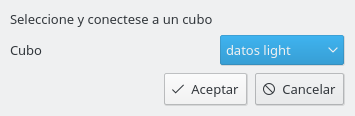
    
    * Convertir vista actual a defecto
    * Guardar Filtros permanetnemente
    * Salvar rango Fechas
* Vista
    * Abrir vista
    
    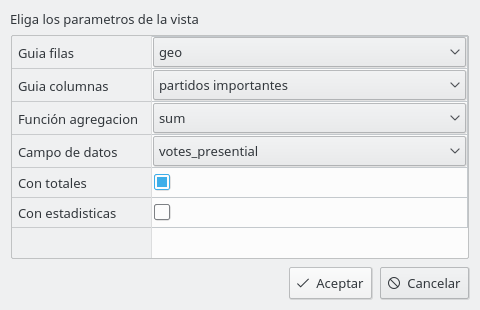
    
    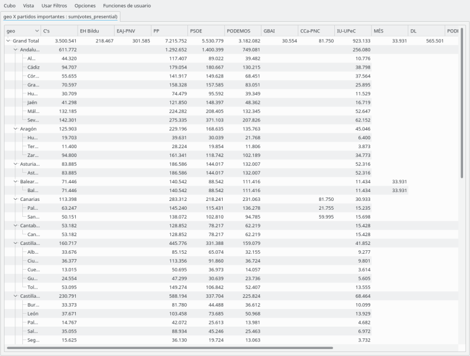 
    
    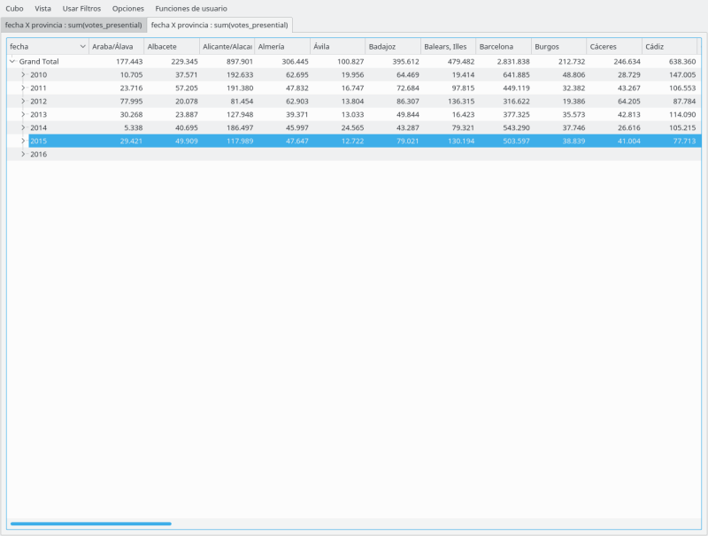
    
    * Cambiar vista actual
    * Cerrar vista actual
* Usar Filtros
    * Editar Filtro
    
    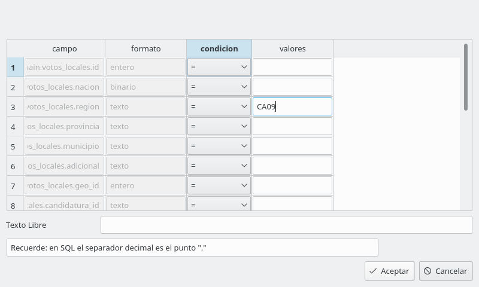
    
    
    
    * Borrar Filtros
    + Editar Rango Fechas
    * Borrar rango fechas

* Opciones
    * Exportar Datos 
    
    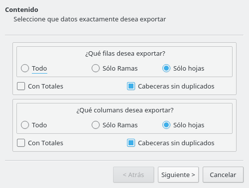
    
    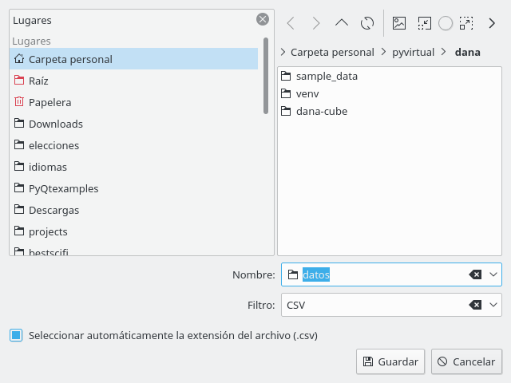 
    
    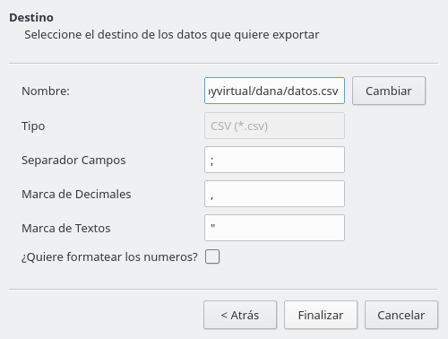
    
    * Trasponer datos 
    
    
    
    * Presentacion 
    
    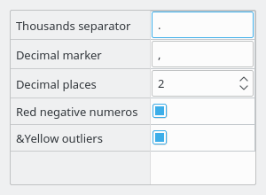
    
    * Graficos 
    
    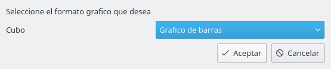 
    
    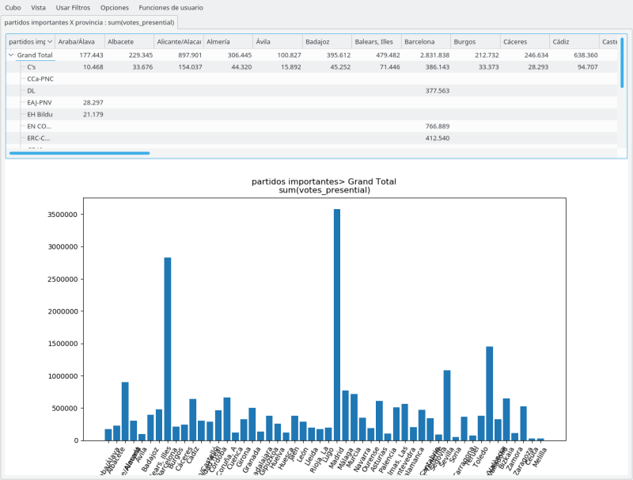
    
* Funciones de usuario
    * restaurar valores originales
    * Funciones generales ... 
    
    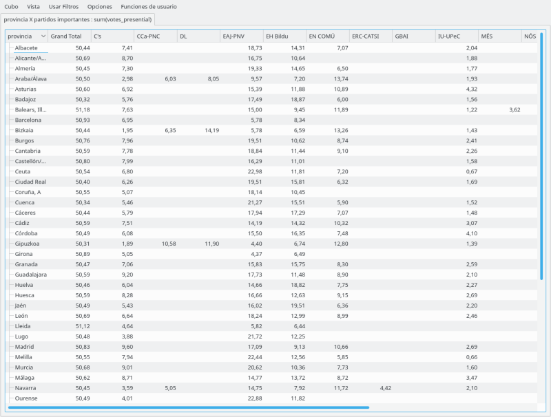
    
    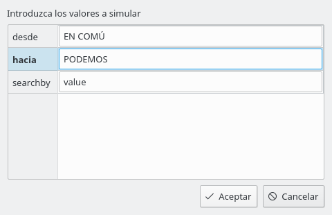
    
    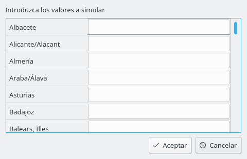
    
    * Funciones especificas ...


# Configurar un cubo
## configurar la conexion
## analizar los datos existentes
## crear el cubo
