__Tabla de Contenidos__

* [Instalar el producto](#instalar-el-producto)
* [Instalar las bases de datos de ejemplo](#instalar-las-bases-de-datos-de-ejemplo)
* [Trabajar con un cubo](#trabajar-con-un-cubo)
    * [Estructura de menus](#estructura-de-menus)
    * [Flujo de trabajo](#flujo-de-trabajo)
        * [Obtener la información](#obtener-la-información)
        * [Filtrar la información](#filtrar-la-información)
        * [Mejorar la presentacion](#mejorar-la-presentacion)
        * [Trasponer datos](#trasponer-datos)
        * [Formatos de presentacion](#formatos-de-presentacion)
        * [Gráficos](#gráficos)
        * [Convertir una vista como defecto](#convertir-una-vista-como-defecto)
        * [Manipular los datos](#manipular-los-datos)
        * [Exportar los datos](#exportar-los-datos)
* [Configurar un cubo](#configurar-un-cubo)
    * [configurar la conexion](#configurar-la-conexion)
    * [analizar los datos existentes](#analizar-los-datos-existentes)
    * [crear el cubo](#crear-el-cubo)


__WARNING__ _during development time, images may not appear in this document_

# Instalar el producto

Por el momento la instalación es manual, es decir una vez instalados en el entorno los requisitos, se descarga la aplicación y listo para ejecutar.
Puede descargar, bien 

* [una version estable](https://github.com/wllacer/dana-cube/releases) o

* clonar el arbol de desarrollo, descargandolo en [formato zip](https://github.com/wllacer/dana-cube/archive/master.zip) o directamente de _git_ 

```
    git clone https://github.com/wllacer/dana-cube.git
```
Si se desea utilizarla como API recordad que debe copiarse en el subdirectorio __site_packages__ de la version de Python que se usa

# Instalar las bases de datos de ejemplo

_Si lo que se desea es meramente evaluar las capacidades del producto, recomendamos utilizar __sqlite__ como "backend", ya que no requiere recursos de base de datos externos a la persona que lo prueba_

* Extraer en un fichero temporal el __sample\_data.zip__ o __sample\_data.tar.gz__  (depende la herramienta que sea mas comoda)
* Crear una base de datos para la aplicació o utlizar una existente (mejor crear, son datos de prueba)
* Cargar en la base de datos el correspondiente fichero *_dump.sql
* Si queremos probar con __sqlite__, sencillamente dejar __ejemplo_dana.db__ en el directorio de trabajo
* Mover al directorio de trabajo el correspondiente  __cubo\*\.json__ renombrandolo como __cubo.json__ simplemente
* Modificar en el fichero __cubo.json__ las clausulas __connect__ para adaptarlas al entorno 

# Trabajar con un cubo

## Estructura de menus

* Cubo
    * Abrir cubo
    * Convertir vista actual a defecto
    * Guardar Filtros permanetnemente
    * Salvar rango Fechas
* Vista
    * Abrir vista
    * Cambiar vista actual
    * Cerrar vista actual
* Usar Filtros
    * Editar Filtro
    * Borrar Filtros
    + Editar Rango Fechas
    * Borrar rango fechas

* Opciones
    * Exportar Datos 
    * Trasponer datos 
    * Presentacion 
    * Graficos 
    
* Funciones de usuario
    * restaurar valores originales
    * Funciones generales ... 
    * Funciones especificas ...
    

## Flujo de trabajo

### Obtener la información

Invocamos a la funcion de menu _Cubo>Abrir cubo_, y nos aparece un selector

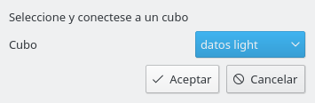

Con el elegiremos el cubo con el que queramos trabajar en nuestra sesión (para cambiarlo, volvemos a elegir la misma opción). Cada instancia de la aplicación trabaja con un solo cubo.

Si la base de datos requiere conexión con usuario y clave, se la pedirá en este punto

Inmediatamente nos aparecera otro diálogo en el que debemos especificar la vista que deseamos calcular

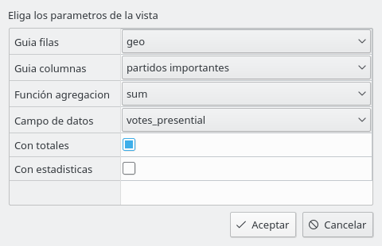

En ella debemos elegir:

* las __guias__ (campos) que deseamos que sean las filas y las columnas de nuestra vista

* La __funcion de agregación__ y el __campo__ sobre cuyos valores queremos hacer los cálculos. Las funciones de agregación son las habituales de base de datos, (_sum_ para suma, _avg_ para promedio,  _count_ numero de ocurrencias y _max_ o _min_ )

* Si marcamos __con Totales__ tendremos una primera fila que representa la agregación elegida sobre todos los elementos del cubo (_Grand Total_ es lo que nos aparece)

* Si marcamos __con estadisticas__ el sistema calcula, para cada fila, una serie de estadisticas y nos marca con fondo amarillo aquellas entradas que pudieran ser valores "anormales" en a distribución de valores (un _outlier_ en inglés). Estos valores se calculan suponiendo una _distribución gaussiana o normal_ y no tienen porqué ser significativos

Una vez elegida, se procesarán los datos y nos aparecera el resultado

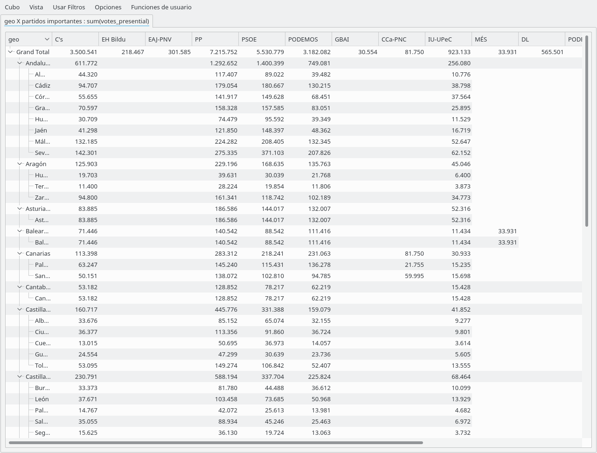 

Si deseamos cambiar alguno de los parametros de la vista usamos el menu _Vista >Cambiar Vista Actual_ 

Si deseamos abrir una pestaña nueva con otra vista sobre el mismo cubo, manteniendo la actual podemos hacerlo con la opción _Vista >Abrir Vista ..._
Un ejemplo de resultado con dos vistas abiertas lo tienen aqui

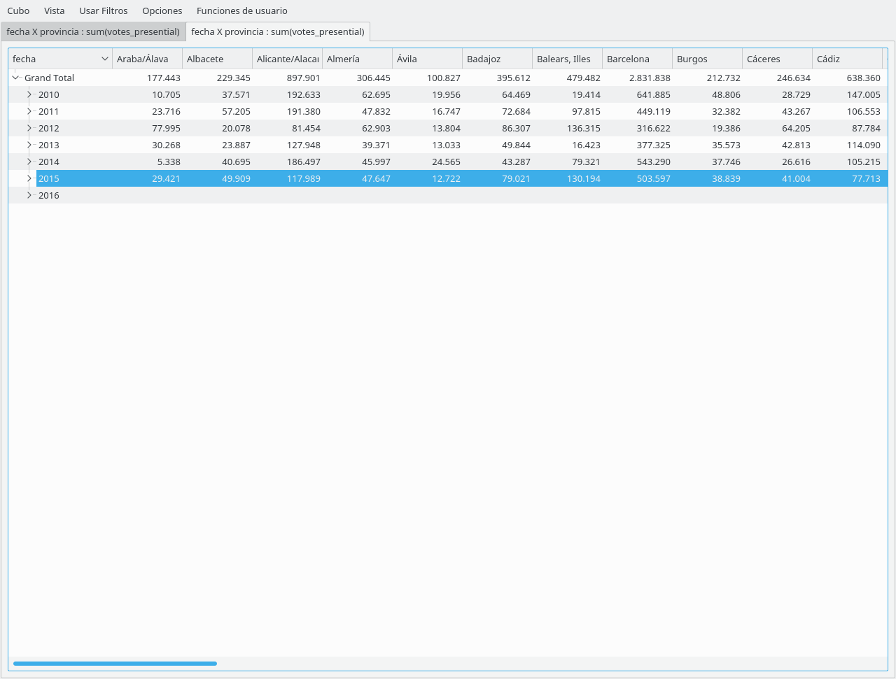


### Filtrar la información

Con la opcion  _Usar Filtro >Editar Filtro_ podemos filtrar datos del cubo original, seleccionando condiciones para cada uno de los campos de la tabla base. Si la condición lógica admite multiples valores deben separarse por comas. Y recordad que el carácter decimal debe ser el punto '.'


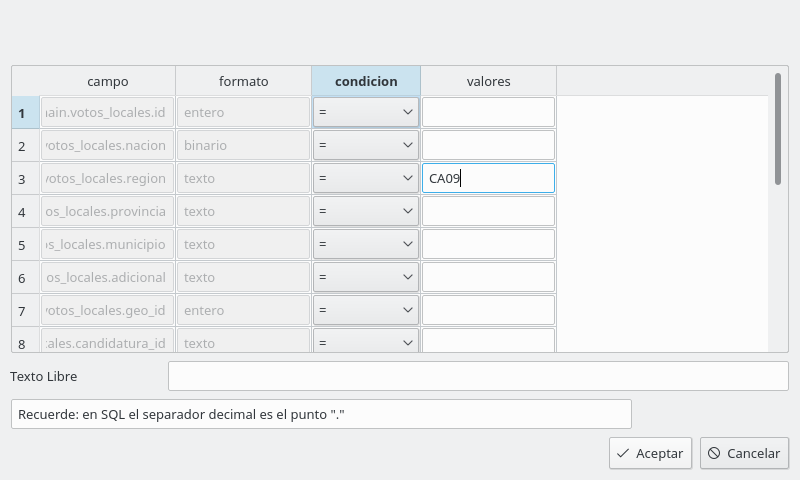

Para los campos tipo fecha tenemos una opción especial para filtrar _Usar Filtro>Editar Rango Fechas_

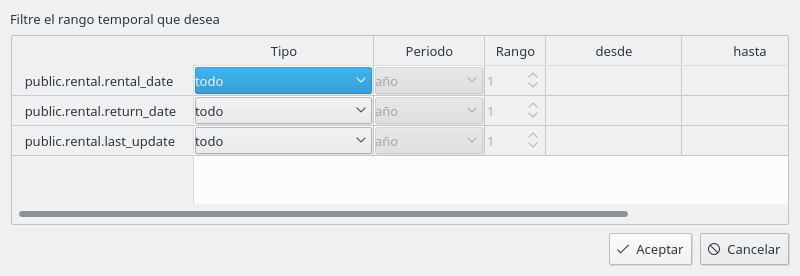

Para cada campo tipo fecha podemos elegir

* Un __Periodo__ , i.e. una clase de intervalo temporal  (año, mes, ...) y un __Rango__, es decir el numero de periodos que cubre el intervalo

* Un __tipo de intervalo__, con las opciones
    * __Todo__   No se filtra por ese campo
    * __Actual__  El periodo que incluye la fecha actual
    * __intervalo__ un conjunto de n periodos  (donde n es el rango) que finalizan el día anterior a la fecha actual.
    * __Ultimo intervalo Abierto__ idm. que finalizan el último día natural del periodo en curso (p.e si es año el 31 de diciembre del año en curso)
    * __Ultimo intervalo Cerrado__ idm. que finalizan el último día natural del ultimo periodo ya completado (p.e si es año el 31 de diciembre del año anterior)

Los campos __desde__ y __hasta__ del diálogo nos permiten ver que fechas estamos eligiendo para los periodos


La opción _Usar Filtro >Borrar Filtros_ o _Usar Filtro>Borrar Rango fechas_ elimina la condición que hayamos elegido anteriormente

En el menu  _Cubo_ existen opciones para hacer esos filtros permanentes para todas las posteriores ejecuciones del Cubo

### Mejorar la presentacion

#### Trasponer datos 

La opción de menú _Opciones>Trasponer datos_ nos permite trasponer la tabla de presentación, es decir convertir las filas en columnas y viceversa. Esta acción se realiza sin necesidad de acudir al gestor de base de datos

#### Formatos de presentacion 

La opción de menú _Opciones>Presentación_ nos permite modificar algunos parametros de presentación

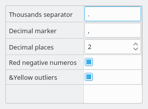

* __Thousands Separator__.  Que caraćter es el separador de miles (por defecto .)
* __Decimal Marker__        Cual es el delimitador de decimales (por defecto ,)
* __Decimal Places__        Cual es el número de decimales con el que se presentan los datos (si no son enteros)
* __Red Negative Numbers__  Si los valores negativos se presentan sobre fondo rojo
* __Yellow Outliers__       Si los valores estadisticamente "outliers" se presentan sobre fondo amarillo

#### Gráficos 

Con la opción de menú _Opciones>Graficos_ controlamos la aparición de una visualización gráfica de los datos. Si se elige alguna representación gráfica los datos de la  fila actual aparece en la mitad inferior en forma gráfica

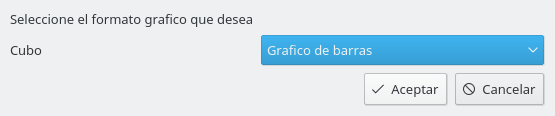 

Eliga los tipos de gráficos:

* __Ninguno__
* __Grafico de puntos__
* __Grafico de barras__
* __idem vertical__
* __idem comparando a superiores en la jerarquia__
* __Grafico en forma de tarta_
* __Boxplot__

La entrada _"comparando ..."_ es un grafico de barras, que para cada columna tiene tantas barras como niveles jerárquicos tenga. 
La entrada _boxplot_ es un grafico que permite visualizar "a grosso modo" la distribución estadística de los valores

Como ejemplo, con gráfico de barras:

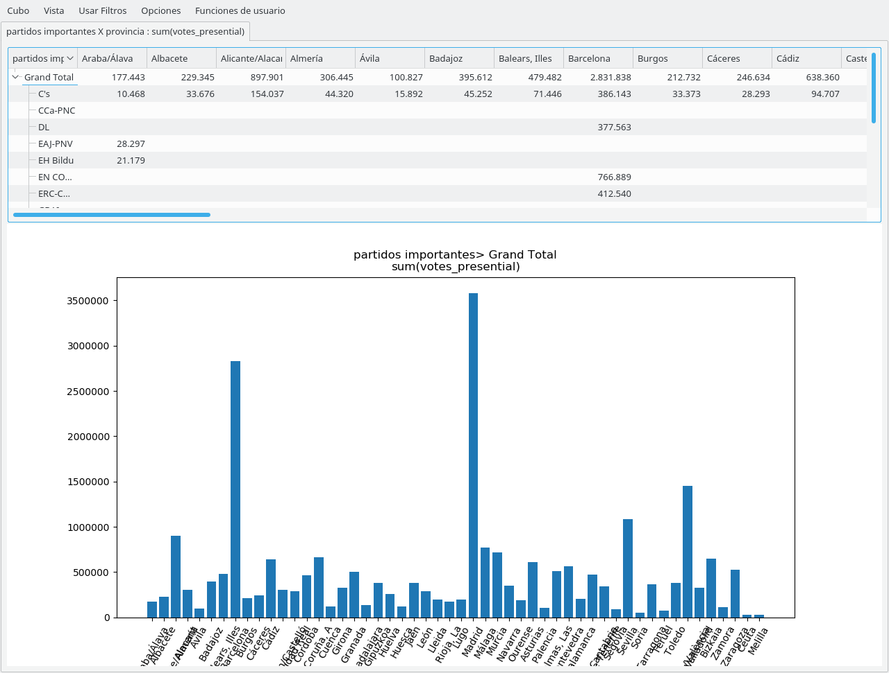

#### Convertir una vista como defecto

Invocando la funcion de menu _Cubo>Convertir vista actual a defecto_ la vista que estamos manejando en ese momento se convertirá en el defecto, es decir, cada vez que se abra la aplicación se cargará directamente esta vista

### Manipular los datos

A través del menú _Funciones de usuario_ podemos invocar acciones que nos permiten manipular los datos. Ver la documentación [aquí](user_functions.md).

* Funciones generales ... 

Nosotros suministramos algunas funciones de carácter general. 

*  _Funciones de usuario/Porcentaje calculados en la fila_ que nos devuelve los valores en porcentajes (siendo 100% la suma de la fila)
 
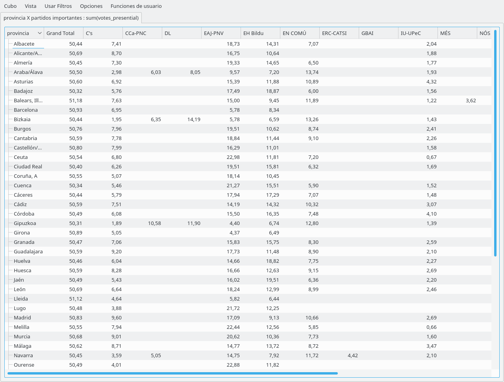

* _Funciones de usuario/Numero de orden descendente en la fila_ que nos devuelve el ordinal dentro de la fila (siendo 1 el de mayor valor)

* _Funciones de usuario/fusiona columnas_ que nos permite agregar el contenido de una columna sobre otra

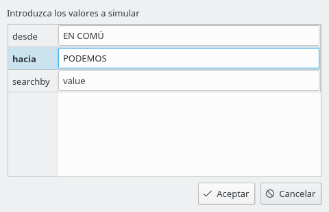

Eneste caso el nombre de la columna esta indicado por el valor del campo __searchby__ del diálogo. Si contiene __value__ es el valor que aparece en la cabecera; si contiene __key__ es el valor interno si fuera distinto (no es normal su uso)

* _Funciones de usuario/realiza simulaciones_ que nos permite modificar el contenido de una o mas columnas. En la implementación de defecto, ponemos un porcentahe de variación sobre el valor actual

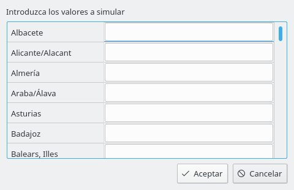

* Funciones especificas ...

El submenú _Funciones de usuario/Funciones especificas para ..._ permite acceder a las funciones de usuario sólo definidas para este cubo

* restaurar valores originales

La opcion de menú _Funciones de Usuario/Restaurar valores originales_ devuelve el contenido de la vista a su valor original, antes de ser procesado por funciones de usuario

### Exportar los datos

COn la funcion _Opciones/Exportar datos_ podemos extraer los datos de una vista para un proceso posterior.

Primero elegimos que información deseamos extraer

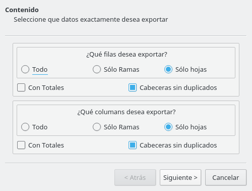

Luego donde y con que formato lo deseamos extraer

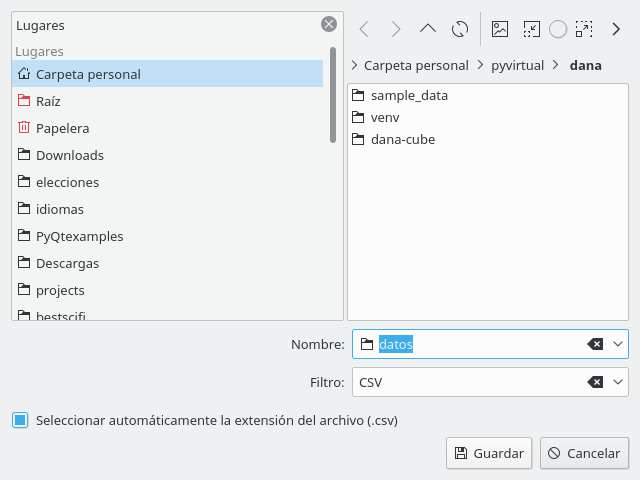 

Actualmente acceptamos los siguientes tipos

* __CSV__ ficheros delimitados por coma 
* __EXCEL__ ficheros Excel, formato XLSX
* __JSON__
* __HTML__ En este caso generamos un fichero con la definición de una tabla HTML no una página web completa

Y finalmente (si es necesario) las opciones necesarias para una correcta descarga de los datos. Se trata de las mismas consideraciones que se utilizan para ficheros CSV


# Configurar un cubo
## configurar la conexion
## analizar los datos existentes
## crear el cubo
